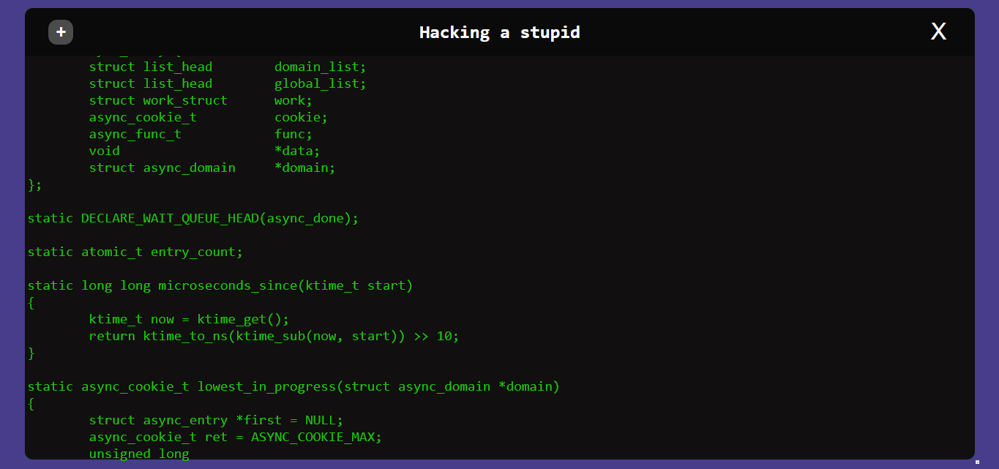

<div align="center">
    <h1>Hacker stupid</h1>
</div>


<br/>

## Simple Hacker type simulation cause i'm bored
Go into the web page hosted in localhost:80 and type anything in anyplace that the terminal will be filled with random script gived by server

<br/>

The server has some dependencies like express, then give a:
```txt
npm install
```

To run just:
```txt
node src/server/server.js
```
